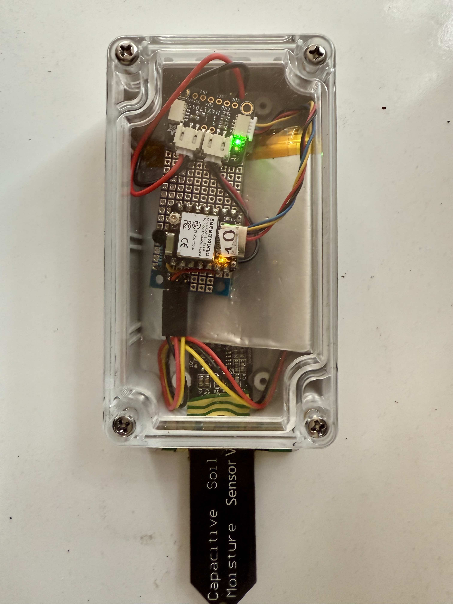
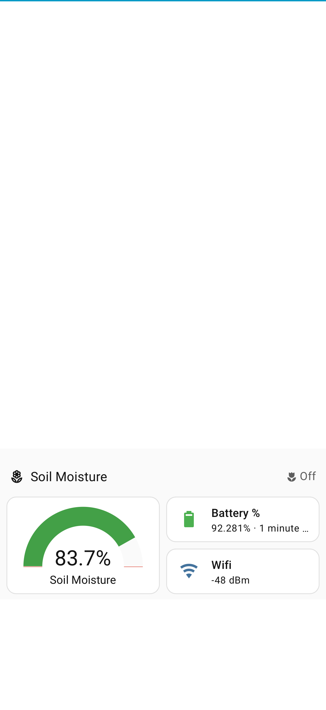

# yet-another-soil-moisture-sensor

## A battery powered soil mositure sensor

## Overview

A project to learn something about electronics/esp32/home automation while keeping your plants and/or garden watered.  It probably suits a hobbyist with a good bit of time to spare, or a high school project, and particularly someone who already has [Home Assistant](https://www.home-assistant.io/) and has heard about, and is curious about esp32's. It may not be the ideal "first" esp32 project but with the onboard led you have all the kit you need to search for and follow a beginners blink test esphome tutorial.  

The finished product and the home assistant dashboard:

   

## Features

- It actually works, it will tell you if your soil is dry!
- Battery powered with battery monitoring and infrequent charging
- [Home Assistant](https://www.home-assistant.io/) integration

## Hardware

- [esp32-c6 development board such as Seeed Studio esp32-c6](https://wiki.seeedstudio.com/xiao_esp32c6_getting_started)
- [3.7v LiPo battery](https://core-electronics.com.au/catalogsearch/result/?q=2400mah%20LiPo)
- [Fuel Gauge such as Adafruit Max17048 Qwiic Fuel Gauge](https://core-electronics.com.au/catalogsearch/result/?q=Adafruit+MAX17048) and [Qwiic Cable if not included](https://core-electronics.com.au/qwiic-cable-50mm-41903.html)
- [Capacitive soil moisture sensor and connector lead](https://core-electronics.com.au/capacitive-soil-moisture-sensor-v20.html)
- [Headers for the esp32 and to connect the sensor to the board ](https://core-electronics.com.au/connectors-sockets/headers.html)
- [2-pin JST PH Connector cable](https://core-electronics.com.au/jst-2-pin-cable.html)
- [N-Channel MOSFET such as 2N7000](https://core-electronics.com.au/n-channel-mosfet-2n7000.html)
- 2 x 100Ω Resistors, 1x 10kΩ resistor
- 26AWG wires (e.g. red, black, yellow)
- External antenna, such as [this](https://core-electronics.com.au/915mhz-ufl-antenna.html), if your esp32 supports an external antenna. (See notes.)
- [Small protoboard](https://core-electronics.com.au/prototyping.html#category_60)
- Enclosure of [one type](https://en.wikipedia.org/wiki/Mason_jar#/media/File:Mason_jar_array.jpg) or [another](https://www.jaycar.com.au/search?q=enclosure)
- USB C cable for charging
- Optionally a breadboard and leads if you don't have them already for prototyping
- Optionally a mix pack of JST connectors for prototyping and in case your wires come with the "wrong" connectors, you can also get pre crimped wires

*Notes on hardware* 

In 2025 this project might cost you AU$60 or more if you don't already have some bits.  While the heart, the esp32, might only cost you AU$9 and the sensor AU$3 the rest adds up and a waterproof polycarbonate enclosure can be AU$30 making a jam jar look attractive.  Many of the above can be bought cheaply in packs for multiple projects.  I have included links to one supplier I use for my convenience documenting the project (in case I forget what I did and why :-) .  There are many cheap and expensive commerical soil sensors out there but I did not find one that integrates with home assistant.  

You can use many of the various esp32 boards, I chose the esp32-c6 only because it has both an onboard antenna and an interface for connecting an external UFL antenna. If you want to put the sensor in the garden where the WiFi might be weak then an external antenna will help.  This board can also handle 4.2v from the LiPo battery without the need to step the voltage down to 3.3v which some require. If you have or buy a different board, the pinouts will likely be different to the diagram below. Avoid a board/chip that is bleeding edge, check [here](https://esphome.io/components/esp32) for a list of types supported in home assistant. 

You can replace the sensor with any sensor that can interface with the [ADC](https://en.wikipedia.org/wiki/Analog-to-digital_converter) [GPIO](https://en.wikipedia.org/wiki/General-purpose_input/output)'s on the esp32.  Note that you need to understand that esp32 GPIOs operates at 3.3v which this soil moisture sensor is fine with, other sensors might require 5v or 12v. Other sensors/suppliers might use different connectors so check what you need to attach to the board. 

I started with a [voltage divider](https://en.wikipedia.org/wiki/Voltage_divider) to measure battery voltage.  While cheap this is basically rubbish due to the [discharge curve](https://www.grepow.com/blog/basis-of-lipo-battery-specifications.html) of LiPo batteries. The Max17408 provides a battery discharge percentage.  Some esp32/microcontoller boards have this built in. There are alternatives on the market.

You don't want to have to charge a battery all the time so choose the largest that will fit in your intended enclosure. 

ESP32's can be placed into a deep sleep mode which draws very little current.  The [mosfet](https://en.wikipedia.org/wiki/MOSFET) allows the esp32 to also turn the sensor off saving battery. Because the soil moisture sensor uses very little current, it is ok to use a mosfet as a switch. (A relay is an alternative for higher current sensors and use cases.) Esp32's GPIOs [float](https://en.wikipedia.org/wiki/Floating_ground) when in deep sleep so the mosfet allows the esp32 to cut the power to the sensor. 

## Tools
- Soldering iron 
- Solder
- Multimeter
- Optionally, phillips screwdriver and long nose pliers

On soldering, I suspect that like the a visit to the dentist you have to question whether anyone really enjoys it.  It is hard to avoid with esp32 projects. If you are new to it youtube is your friend. Buy a soldering iron designed for electronics and fine gauge solder. You might also want a magnifying glass stand, maybe a "third hand" with clips. If you want crushing critisism of your work try uploading an image of your finished board to chat GPT. 


##  Wiring diagram


## Software 


### Esphome

This project is a [Home Assistant](https://www.home-assistant.io/) project because that makes it more fun and useful. (There are many tutorials out there with standalone soil moisture sensors with LCD or OLED or other displays for Arduino etc.) Home assistant allows you to do something with sensor data, such as send a notification to your phone or in this case you might want to turn on your automatic wartering system or adjust the wartering duration depending on the sensor reading.

If you are new to home assistant, there is a bit of work to do.  I suggest home assistant green and youtube are good places to start.  

With home assistant running, if you have not already, get esphome set up.  Again youtube has all the answers.  

In brief, connect the esp32 USB to the computer you are browsing to home assistant from via USB. At this stage you don't need anything connected to the esp32.  From the esphome user interface select new device then esphome web, then connect, then prepare for first use, then enter your wi-fi credentials. You can how edit the esphome device you just created.  At this point you might want to edit the device yaml for a simple blink test.  The lines below are the key ones to get an led defined in home assistant.  You will need to add the esphome device to home assistant just like any other device. Once created visit the device and it should have a Control called User Led with which you can turn the led on and off - proving you have all the building blocks in place. Once you have it working Irecommend setting a [static IP address](https://esphome.io/components/wifi/) on your router and in the esphome configuration in case it changes with a power cut or whatever. 

```
substitutions:
  name: esp32-c6
  friendly_name: SoilMoistureSensor
  user_led_pin: GPIO15

esphome:
  name: ${name}
  friendly_name: ${friendly_name}
 
light:
  - platform: status_led
    pin: 
      number: ${user_led_pin}
      inverted: true
    name: "User Led"
    id: user_led
```
With a sucessful blink test you are ready to replace the esphome device yaml with the *esp32-c6.yaml* file and install to the esp32.  *Be careful to keep your configuration items such as ip address, api and ota passwords*.    

#### esp32-c6.yaml

This is content for esphome which esphome will flash to the esp32 device. This is a working example and far from perfect.  You can and paste it into ChatGPT for an explanation of each section and doubtless commentary on faults.  

Much of it is not required per say, but I have found it useful to, for example, flash the led so you can tell when the esp32 is booting, connected to WiFi etc. You can also define deep_sleep much more simply per the [official HA docs](https://esphome.io/components/deep_sleep/).  I have found it useful, however, to define the sleep duration at runtime from home assitant rather than baking it into the esp32 firmware where a change requires a recompile.  The esp32 sends an event to home assistant when it wakes from deep sleep so that home assistant can perfom actions. 

### Home Assitant Automations

If you choose to specify the deep sleep duration in you esphome yaml then you don't need these automations *at all*.  As I was learning and debugging I just found it handy to have logs and notifications of what was going on ie "why did my sensor die after only 2 days?"

Note these automations *rely on naming conventions* for your esphome device.  I started with "esp32-1, esp32-2..." for the friendly name and just ran with it.  You can use any convention you like but it can be handy to be consistent so you can use [templates](https://www.home-assistant.io/docs/configuration/templating/) such as `input_boolean.{{ esp_device }}_online` rather than many statements of almost identical code.

#### esp32-event-automation.yaml

When you first add deep sleep to an esp32 device you might notice that it goes unavailable.  The fix is to delete the device and re-add it, after which home assistant and any dashboards you have created will show the last known value.  The downside of this is that you sometimes want to know if the device is actually on.  You could use the last updated state in the dashboard for this but I ended up defining a toggle helper for each esp32 which can be displayed on the dashboard and trigger automations.  These helpers at least allow this automation to be simple and any automations for different types of sensors separate.  

#### soil-moisture-automation.yaml

As mentioned under *esp32-c6.yaml* above I found hardcoding deep_sleep duration unreliable and inflexible.  For another use case I wanted a different deep sleep pattern based on time of day and locations - probably not necessary for a soil moisture sensor but I suppose you might want it to wake before and after an automated watering then not for a day. 

The main reason sleep_duration_ms is calculated is so that I could take a reading once a day at about the same time and I might have recharged it during the day.  

## Step by Step

Having purchased the hardware, I suggest the following steps:
1. Perform a blink test with the naked esp32 and esphome as described under Software - esphome.
2. Prototype your hardware solution using a breadboard and the wiring diagram above. Before powering on with either the USB or battery, check and re-check all connections intended and otherwise against the schematic.  You might need some female JST connectors to join the male JST connectors from the battery and the esp32 to the breadboard. Run your initial tests with the USB attached.  The esp32 red led should blink to indicate the battery is charging.
3. Get your device visible in esphome as described under Software - esphome.  You should have a User Led control, a soil moisture sensor and diagnostic battery, voltage and WiFi signal.  
4. Run a wet finger over the surface of the soil moisture sensor.  Shortly it should show as a percentage in home assistant.  If you are getting 0% or 100% see Troubleshooting.
5. Test the voltage across VCC and GND on the sensor, it should be ~3.7v.
6. In home assistant navigate to Developer Tools - Actions. Search for "esp" to find the service with a name like esphome.esp32-c6-enter_deep_sleep.  Set a duration of ten seconds (enter 10,000 miliseconds).  Test the voltage across VCC and GND on the sensor, after a few seconds it should drop to zero or near zero.  If so sucess, everything is working!
7. Now repeat the process for real by soldering the components to the protoboard. I recommend soldering a header to the protoboard so that you can easily remove the esp32 when you are soldering (ie you dont want to overheat the esp32 with clumsy soldering and you might want the esp32 for something else later).  Be careful when soldering the battery terminals, tin the wires first and dont take too long!  The resistors and mosfet are pretty robust against the heat from soldering.  You can probably fit everything on a very small protoboard but for your first go I recommend laying it out so that you can see what you have done with all the connecting wires on the surface and only adjacent holes connected on the underside.
8. Before powering on, check and re-check all connections intended and otherwise against the schematic and your working breadboard prototype, a maginifying glasss helps check for "cold joints" and the wrong holes being connected.
9. Plug in the battery and test as steps 4-6.
10. In the unlikley event that all worked perfectly, you are now ready to create an automation in home assistant such that the sensor is on for 5 minutes a day and aleep the rest of the time.  See Software - Home Assitant YAML above.    

## Troubleshooting

### Hardware

Of course it was not that easy.  Breadboards can have unreliable loose connections and soldering incorrectly as you turn the protoboard over and over is easily done.    

A multimeter is essential.  

Basic tests are; is the battery charged, is the esp32 powered with ~3.7v across GND and 3.3v pinout.  Is the sensor powered across VCC and GND. If not, is it the same with just the battery and when the USB is connected.  

More than likely you are looking for an intended connection which is not sound or a short between two places that should not be connected.  This can be harder in the finished product compared to the breadboard prototype (size, visibility).  ChatGPT is pretty good and giving you a set of diagnostic tests if you describe in detail what you are doing and seeing.   A more high tech way of finding problems is to poke a wire through one side of the protoboard then turning it over to see where the wire is to confirm all the soldering is where you expected. 

### Home Assistant integration issues

#### esphome compile errors

If you edit the esphome yaml file and it does not compile then you just have to use ChatPGT, redit forums etc.  YAML is indentation fussy so check that first.

If the esphome compiles and uploads and the sensors appear in home assistant but dont show the values you expect then you probably have a hardware problem. 

## Installation

git clone https://github.com/bicycleboy/yet-another-soil-moisture-sensor

cd yet-another-soil-moisture-sensor

## License

This project is free to use under the [MIT License](https://github.com/bicycleboy/yet-another-soil-moisture-sensor?tab=MIT-1-ov-file).
